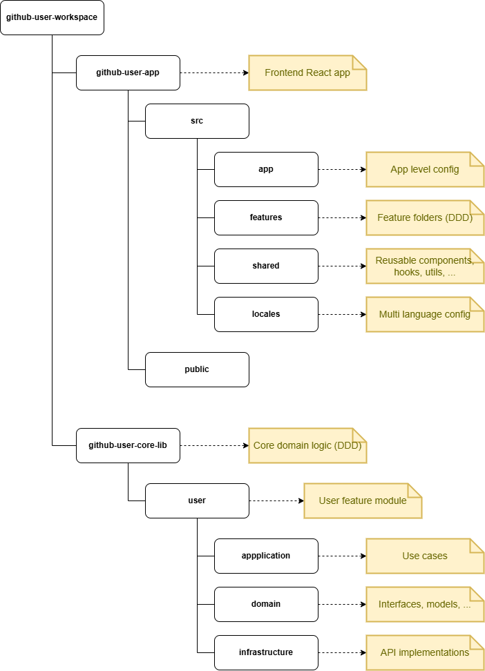
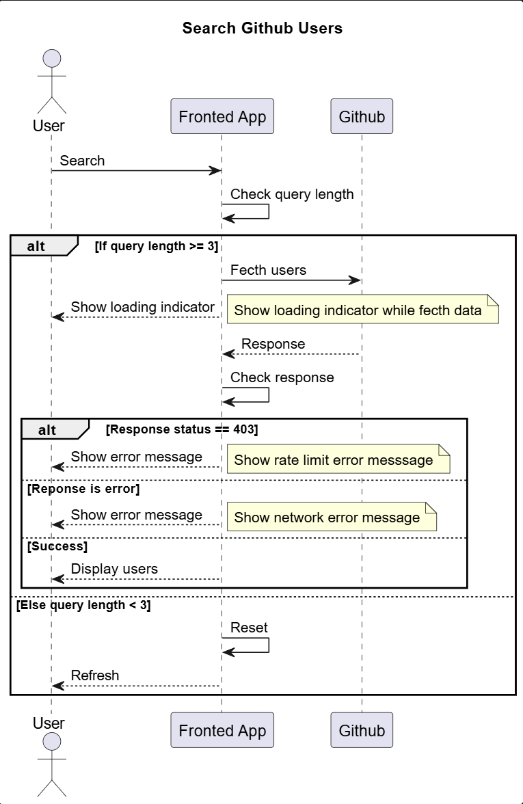

# GitHub User Search App

A responsive React web application to search GitHub users with live filtering, debounced input, and clean architecture. This project is structured as a monorepo with reusable core logic and scalable frontend features.

## Features

- Live search GitHub users (via GitHub REST API)
- Debounce user input to reduce API calls
- Cancel stale requests to prevent race conditions
- Loading indicator & friendly error messages
- Multi language support (English & Vietnamese)
- Material UI responsive design
- Domain-Driven Design (DDD)
- Core library reusable across apps
- Monorepo managed with Yarn workspaces
- Unit tests with Jest & React Testing Library

---

## Project Structure

### Project structure 

### Sequence diagram
    

### Design Details 

- Project structure: [main.drawio](main.drawio)
- Sequence diagram: [sequence.puml](sequence.puml)

---

## Getting Started

### 1. Clone the repo

    git clone https://github.com/tricao86/github-user-workspace.git
    cd github-user-workspace

### 2. Install dependencies

    yarn install

### 3. Build core lib && app

    yarn build

### 4. Run the app

- Run the app with DEV environment

        yarn dev

- Run the app with SIT environment

        yarn sit

- Run the app with UAT environment

        yarn uat

- Run the app with PROD environment

        yarn prod

## Running Tests

### From root

    yarn test

## Package Publishing

---

The github-user-core-lib is written to be reusable and can be published to a private registry (JFrog, Nexus, ...) and installed via Yarn.

### From root

    cd github-user-core-lib

### Build core library
    yarn build

### Then publish
    npm publish --registry <artifactory-url>

---

